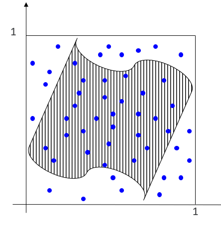
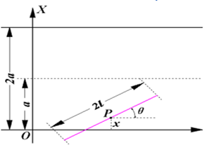
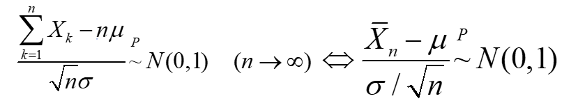
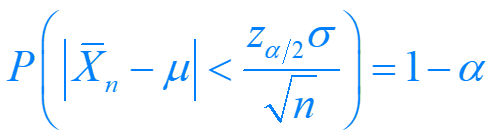
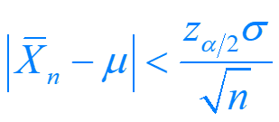
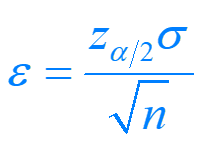

# Monte-Carlo方法

[TOC]

##  Monte-Carlo方法简介

###  1. 引例：面积的计算



求阴影部分的面积 - **随机投点试验**求近似解。

$P(a)=S(a)/div(\Omega)$

其中，每个点都服从0-1分布，用事件的频率估计参数的值。


### 2. 基本思想 - Buffon投针实验



针与平行线相交的条件：p = $P(x \leq lsin \theta)$

体现： 频率的稳定性，$p = 2l / (\pi a)$，可以用来计算圆周率。

应用：计算圆周率值。

matlab的实现：

```matlab
function piguji=buffon(llength1,llength2,mm)
%llength1,llength2分别表示1/2线的宽度和针的长度
%mm 是随机实验次数
xrandnum = unifrnd(0,llength1,1,mm);
theta= unifrnd(0,pi,1,mm);
frq=0;
for ii=1:mm
    if (xrandnum(1,ii)<=(llength2*sin(theta(1,ii))))
        frq=frq+1;
    end    
end    
piguji=(2*llength2/llength1)/(frq/mm)
end

```

建模的一般过程：

建立模型 - 生成随机数 - 随机抽样 - 求出随机解 - 模拟结果的生成

### 3.Monte-Carlo的理论分析

​	i. 理论基础

​		大数定律 - 试验数足够大时，实验值会依概率逼近真实值。

​		中心极限定理 - 



​	ii. 误差分析

​			根据中心极限定理，

​			表明q不等式,

​			近似地以概率1-a成立。

​			**因此，Monte Carlo问题的误差为：**



​	iii. 随机数的生成

​				a. matlab中的随机数生成函数

>rand(m,n);		%（0-1)分布
>
>unifrnd(a,b,m,n);		%（a，b）均匀分布
>
>randn(m,n);		%标准正态
>
>normrnd(mu,sigma,m,n);		%正态分布
>
>exprnd(theta,m,n);		%指数分布
>
>poissrnd(lamda,m,n);		%泊松分布
>
>binornd(n,p,m,n);		%二项分布

​				b. 一般随机数生成方法

| 基本方法 | 定理 |
|:--:|:--:|
|逆变换法|设随机变量U服从(0,1)上均匀分布，则X=F^-1(U)的分布函数为F(x)|
| 复合抽样方法 |      |
|  | |


​			

## 应用实例

### 1. 定积分的计算

方法特点：Monte Carlo方法计算误差于维数n无关。

随机投点法 	 –>	 $\theta=\int f(x) dx$

方法概述：

​	设a，b有限，0 < f(x) < M，$\Omega$={(x,y) | a $\leq x \leq b, 0 \leq y \leq M$}，假设我们向*W*中进行均匀随机投点，则点落在*y*=*f*(*x*)下方的概率*p*为：
$$
p = \theta\diagup{(M(b-a))}
$$


##  排队问题的模拟

## 眼科病床模型

