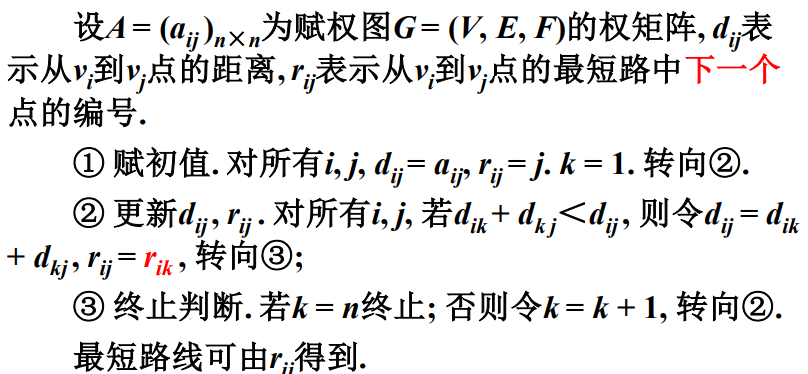

# 图论模型

[TOC]
## 基本概念
1. 几个经典问题
> 欧拉问题 - 每个节点都有偶数条边相连2，则必有路径能遍历每一边后回到出发点。<边遍历>
> 汉密尔顿问题 - <点遍历>
> 四色问题 - 四种颜色对地图着色，不会重复颜色
> 关键路径问题 

2. 称一个有序二元组为图。V->顶点 ;E->边

3. 一条无向边可以看成两条方向相反的边：**有向图成立的结论一定适用于无向图，无向图的性质你不一定适用于有向图**。

4. 图解：对图的显式表达，图可以有不同的图解（同构图）。
==同构图的点、边必须相互对应==

5. |点-点|点-边|
 |--|--|
|相邻|关联|

6. 节点度数 -> 与该节点相关联的边的条数
	对于有向图，我们有：**入度**和**出度**，与边的方向有关
7. 握手定理 - 所有结点的度数之和等于2倍边数。（2m）
	$$
	\sum(d(v_i))=2*m
	$$
> *推论：*
> 无向图中必有偶数个度数为奇数的节点，2m。
> 有向图中所有结点的出度之和一定等于入度之和，等于边数，m。
8. 有限图 - 节点个数有限
9. 简单图 
	a. 不存在自回路；
	b. 两顶点间不存在重复边
10. 有限简单图（略）
11. 子图 - 两个图之间有子图关系时称G与G'呈子图关系。
    生成子图 - 节点个数相等的子图对。
    赋权图 - 每条边对应一个实数，相当于对边加权。
    连通图 - 任意两点均有通路的图。
    	~强连通，单侧连通，弱连通（有向图不连通，无向图连通）~
    树 - 连通无圈
    生成树 - 生成子图 + 树
## Ramsey问题
抽化为：完全图问题
即n个节点的完全图必然有$m = n * (n - 1) / 2 $个节点。
对每条边进行着色，一定存在一个K~3~

图论证明 
	现象1 对图形任意节点的边进行涂色，必有三条边涂的是同一种颜色。
	现象2 对任意两个着色的边找出一个未着色的边进行着色，不管卓真么颜色，总会有一个同色三角形出现。
	证毕。

## 过河问题

* 抽化为：状态坐标0110，0011，0111，1001，1100，1000六种状态为不安全状态，将可执行的状态做出图解；也就是一个从1111到0000的过程，一次变一位数，求最终的可能性路径（和最短路径）的问题。 *

## 图的矩阵表示
### 1. 邻接矩阵
   点：每列代表入路径，行代表出路径；0代表无路径，1代表有路径。
   点数：矩阵列数
   边的条数：矩阵元素的求和
   结论：
若
   $A^k=(a^k_{ij}) $
   $a^{(k)}=(a^{(k)}_{ij})$
   $则v_i到v_j有t条长为k的路径$

### 2. 权矩阵
### 3. 关联矩阵
特征： 
|1| v~i~是e~j~的始点|
|:--:|:--:|
|-1 |v~i~是e~j~的终点|
|0 |不关联|
无向图的关联矩阵每列元素有且仅有两个1.

### 4. 例题：锁具问题
参考思路：邻接矩阵乘方。

## **最短路径问题**

P(u,v)是赋权图G=(V,E,F)从u到v的路径，用E(P)表示P(u,v)表示P(u,v)中全部变的集合，称F(P)为路径的最短路径。
$F(P)=\sum_{e \in (E(p))} (F(e))$

### Dijkstra算法

指标 - 将V拆分为两个集合，从一个集合的一点出发，不经过该集合内的其他点而使其到达另一集和的一点所经过的距离为指标。

最小指标的节点到目标点的路径是所求的最短路径。
> ***注意：***
> l(~t~)不一定是最短路径，因为其最短路径中还可能经过对方集合的其他节点
将每次划分后的最小指标不断地归到P指标中，不断算出新集合的指标直至出现空集。

算法：

如下表所示：

|V~i~|P/T|Pro|L(t)|||||
|:--:|:--:|:--:|:--:|:--:|:--:|:--:|:--:|
|A|1|||||||
|B|2|a|1|||||
|C|3|a-b|4|3||||
|D|5|b|inf|8|8|7||
|E|4|b-c|inf|6|4|||
|F|6|e-d|inf|inf|inf|10|==9==|

结论：
	路径为A-B-C-E-D-F
	最短路径：9 

### Dijkstra算法改进

1.   算法

    

改进算法后的代码需求：
*最短路径指的是距离，而不是路径，更改权重可能会使路径发生变化。此时不能简单地用一维数组存储Pro变量，应当将其改为一个m$\times$n的二维数组。*
*新的程序需求：多路径的读取和遍历回溯。*

### Floyd算法

**求任意两点间的最短路径**

! <算法复杂度高>

注意最终结果矩阵A,D,R三者的对应关系，及其不同位置坐标所代表的释义。

## **最小生成树问题**

**

## **遍历性问题**

### 1. 欧拉问题

条件：==经过每个边一次且仅以此==

G = (V, E)，连通无向图

### 2. 中国邮递员问题

解法：

>   若本身是欧拉图，可以找到一条欧拉巡回，欧拉巡回即为问题的解。

>   若不是欧拉图，必定有**偶数个奇度数结点**，在这些奇度数结】点之间添加一些边，是之变成欧拉图，进而找出一个欧拉巡回。

算法：

>   Fleury算法 + Edmonds最小对集算法

### 3. 哈密尔顿问题

条件：==经过每个点一次且仅一次==

*拓展：如何设计程序判断是否为哈密尔顿图*

TSP问题的解法属于NP完全问题，一般只研究其近似解。

#### 最邻近算法 ：依次找权重小且不构成回路的边。

1.  选取任意一点为起始点，找出与该点相关联的一条边，形成一个初始路径；

2.  找出新加入路径中的点相关联的权重最小的边加入到路径中，==并要求路径中不能产生回路==；

3.  重复步骤2，直至所欲点都加入到路径中；

4.  将起点和最后加入的节点之间的边加入到路径中，形成Hamilton回路。

> **注意**：
> 这个算法只能算出近似解，且大概率不是最优解！

局部最优解，是贪心算法。

可以先通过最邻近算法求出局部最优解，然后再用人工神经元算法，遗传算法等对其进行优化。

## **二分图与匹配**

1.  二分图（二部图）

2.  匹配 - 

    完美匹配 - 

3.  工作安排问题

## **网络流问题**

### 1. 容量网络

取G=(V, E)中一点为发点（V~s~），一点为收点（V~t~），其余点为中间点，对每一条边都对应一个非负的**容量**，这样的G为容量网络，简称网络。

### 2. 流与可行流

### 3. 最大流问题：在容量网络中，寻找流量最大的可行流

### 4. 最小费用问题

### 5. <自虐版> 最小费用最大流问题

迭代步骤

## **拓扑排序问题（关键路径问题）**

### 1. Potentialtask graph (PT图)

其中，$\pi$为开工时间集，$\mu$为加工用时，有多个箭头流入的点X~i~为关键工序，既不能被提前执行，也不可延后执行，加工X~i~耗时如下：

$\pi$(X~i~) = max {$\pi(X_j)+\mu(X_j) , \pi(X_k) + \mu(X_K)$}

## **监控模型**

### 1. 理论基础

对于G=(V, E)，且L每条边至少有一个顶点在K中，称K为G的点覆盖。

### 2. 最小点覆盖

### 3. 最大独立点集

### 4. 最小控制集

## **着色模型**

解法：将所有着色情况利用对偶关系最终转化为顶点着色模型进行作色。

### 1. 顶点着色

### 2. 边着色

方法：点化边，边化点，针对对偶图的顶点进行着色。

### 3. 区域着色

方法：对每个区域构造一个结点（外侧也是一个区域），链接相邻区域的结点，转化为结点间线段的涂色问题。

### 4. 物资存储问题

不相容的药品不能放在一个仓库里，问需要多少个储藏仓库。

做图G，v~1~, v~2~, … , v~n~表示n种化学品，顶点v~i~与v~j~相邻，当且仅当化学品A~i~与A~j~不相容。

### 5. Wellsh - Powell算法

